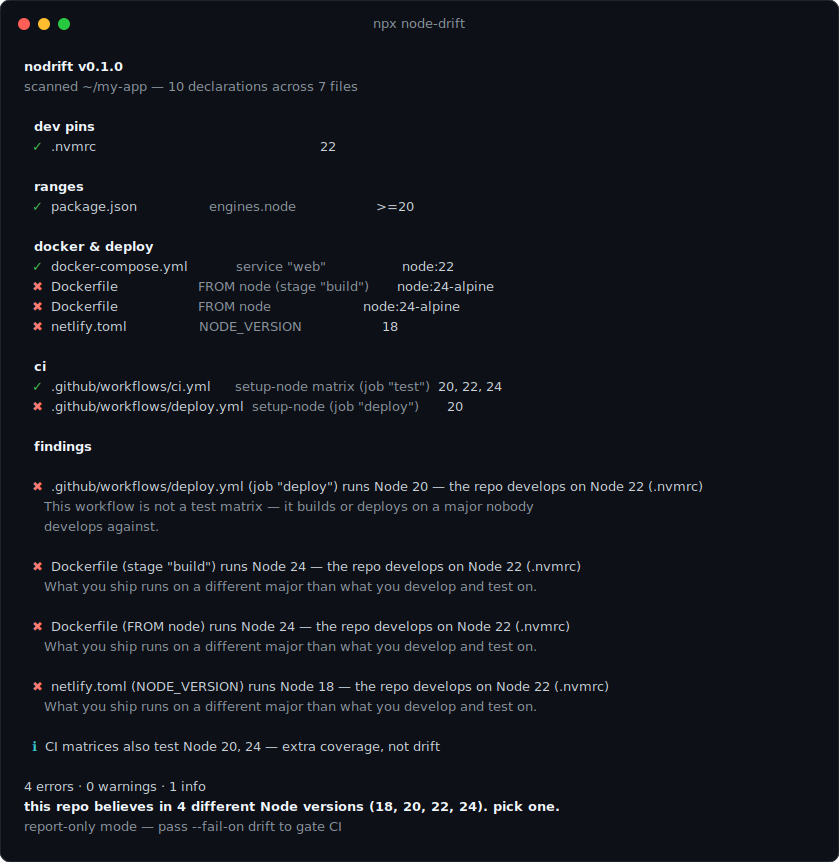

# nodrift

[](https://www.npmjs.com/package/node-drift)
[](https://github.com/gapchix/node-drift/actions/workflows/ci.yml)
[](./LICENSE)

**Finds every place your repo declares a Node.js version — `.nvmrc`, `engines`, Dockerfiles, CI workflows — and reports where they disagree.**

Your repo declares its Node version in five places. At least two of them are lying.

<p align="center">
  
</p>

## The war story

A staging deploy started failing in a way local machines couldn't reproduce: `npm ci` rejected the lockfile. The cause took embarrassingly long to find — the lockfile had been regenerated on a laptop running one Node major, while the Docker image built with another. The only fix that stuck was regenerating the lockfile **inside** the image (`docker run node:24-alpine npm install …`), because nothing in the repo actually said which Node was the real one. The `.nvmrc` said one thing, the Dockerfiles said another, CI quietly tested a third.

Every repo accumulates this: a `.nvmrc` from the project's first week, `engines` added during some incident, `FROM node:X-alpine` copy-pasted between Dockerfiles, `node-version:` hardcoded in workflows. Each file is locally reasonable. Nobody checks them against each other.

`nodrift` is that check. One command, no config, report in under a second.

## Quickstart

```bash
npx node-drift
```

> **Why `node-drift` and not `nodrift`?** npm's typosquat rules block the unscoped `nodrift` (an unrelated `no-drift` timer library normalizes to the same name). The npm package is `node-drift`; the installed command is plain `nodrift` — both spellings work with `npx`.

Output for a repo with exactly this disease:

```
nodrift v0.1.0
scanned ~/my-app — 10 declarations across 7 files

  dev pins
  ✓  .nvmrc                                                        22

  ranges
  ✓  package.json                  engines.node                    >=20

  docker & deploy
  ✓  docker-compose.yml            service "web"                   node:22
  ✖  Dockerfile                    FROM node (stage "build")       node:24-alpine
  ✖  Dockerfile                    FROM node                       node:24-alpine
  ✖  netlify.toml                  NODE_VERSION                    18

  ci
  ✓  .github/workflows/ci.yml      setup-node matrix (job "test")  20, 22, 24
  ✖  .github/workflows/deploy.yml  setup-node (job "deploy")       20

  findings

  ✖  Dockerfile (stage "build") runs Node 24 — the repo develops on Node 22 (.nvmrc)
     What you ship runs on a different major than what you develop and test on.

  ✖  .github/workflows/deploy.yml (job "deploy") runs Node 20 — the repo develops on Node 22 (.nvmrc)
     This workflow is not a test matrix — it builds or deploys on a major nobody
     develops against.

  ✖  netlify.toml (NODE_VERSION) runs Node 18 — the repo develops on Node 22 (.nvmrc)

  ℹ  CI matrices also test Node 20, 24 — extra coverage, not drift

4 errors · 0 warnings · 1 info
this repo believes in 4 different Node versions (18, 20, 22, 24). pick one.
report-only mode — pass --fail-on drift to gate CI
```

That report is real — it's what the tool prints for [the fixture repo](./fixtures/drifty) in this repository.

## What it reads

| Where                                 | What                                                                                                                                                                      |
| ------------------------------------- | ------------------------------------------------------------------------------------------------------------------------------------------------------------------------- |
| `.nvmrc`, `.node-version`             | the classic pins (comments, `v` prefixes, `lts/jod` codenames included)                                                                                                   |
| `package.json`                        | `engines.node` (range) and `volta.node` (pin)                                                                                                                             |
| `.tool-versions`, `mise.toml`         | asdf / mise pins                                                                                                                                                          |
| `Dockerfile*`, `Containerfile`        | every `FROM node:…` across all stages — `ARG` defaults are substituted, `${VAR:-fallback}` included                                                                       |
| `docker-compose*.yml`, `compose*.yml` | `image: node:…` per service                                                                                                                                               |
| `.github/workflows/*.yml`             | `actions/setup-node` versions — scalars, arrays, `${{ matrix.* }}` and `${{ env.* }}` resolved, `node-version-file:` followed to its target — plus job `container` images |
| `.gitlab-ci.yml`                      | default and per-job `image: node:…`                                                                                                                                       |
| `netlify.toml`                        | `NODE_VERSION` in any environment block                                                                                                                                   |
| `.devcontainer/devcontainer.json`     | the `image` and the node feature `version` (JSONC handled)                                                                                                                |

Discovery is recursive with the ignore list you'd expect (`node_modules`, `dist`, `.next`, …), so monorepo sub-app Dockerfiles are found without configuration.

## How drift is judged

Not every disagreement is a bug, so the rules are deliberately opinionated:

1. **The anchor** is what your repo _means_ by "our Node version": `--expect` if you pass it, else `volta.node` > `.nvmrc` > `.node-version` > `.tool-versions` > mise. Dev pins that disagree with each other are drift.
2. **Hard pins elsewhere** (Docker images, deploy workflows, `NODE_VERSION`) on a different **major** than the anchor → ✖ error.
3. **`engines.node`** that _excludes_ the anchor → ✖ error (npm warns the very people following your own version file).
4. **CI matrices are respected**: a matrix testing extra majors is coverage, not drift (ℹ). But if _no_ CI job runs the anchor version → ⚠ `untested` — the version you actually develop on ships unexercised. And a single-version deploy workflow on the wrong major is a full ✖.
5. **Floating versions** (`latest`, `lts/*`, a bare `node` image, an untagged `FROM node`) → ⚠ `float`: they quietly change meaning at every Node release.
6. No dev pin at all? `engines.node` becomes the reference. Nothing at all? _"living dangerously."_

Everything unparseable is reported honestly as a note — the tool never guesses.

## Usage

```
nodrift [dir] [options]

  dir                  repo root to scan (default: cwd)

  --json               machine-readable output
  --fail-on <checks>   comma-separated: drift, float, untested, or all —
                       exit 1 when those checks produce warnings or errors
  --expect <version>   the version every declaration should agree on
  --config <path>      explicit config file path
```

Default is **report-only** (exit 0). Opt into failing your pipeline:

```yaml
- run: npx node-drift --fail-on drift
```

Exit codes: `0` clean or report-only · `1` failing findings · `2` audit error.

### Programmatic API

```ts
import { runAudit, shouldFail } from 'node-drift';

const result = runAudit({ dir: '.' });
console.log(result.verdict);
if (shouldFail(result, ['drift'])) process.exit(1);
```

## Recipes

### CI gate

```yaml
jobs:
  nodrift:
    runs-on: ubuntu-latest
    steps:
      - uses: actions/checkout@v5
      - run: npx node-drift --fail-on drift
```

No `setup-node` version to pick for this job without irony — any Node ≥ 20 on the runner will do.

### Pin everything to one version, verify forever

```bash
npx node-drift --expect 22 --fail-on drift,float,untested
```

`--expect` overrides the discovered anchor, so this also catches the case where the `.nvmrc` itself drifted.

### Machine-readable output

```bash
npx node-drift --json | jq '.findings[] | select(.severity == "error")'
```

### Monorepos

`nodrift` deliberately audits the whole repo as one unit — "this repo believes in N Node versions" is the point. If sub-apps legitimately run different majors, scope the audit per app (`npx node-drift apps/web`) or exclude paths via `ignore` in the config.

## Configuration

Optional — `nodrift.config.json`, `.nodriftrc.json`, or a `"nodrift"` key in `package.json`:

```json
{
  "expect": "22",
  "ignore": ["legacy/*", "fixtures*"],
  "failOn": ["drift"]
}
```

`ignore` globs match repo-relative paths (`*` matches anything). `failOn` sets the default for the `--fail-on` flag.

## vs. adjacent tools

They compare your **running** Node against one file; `nodrift` compares **every declaration against each other** — no runtime involved, so it catches the drift before anyone installs anything.

| Tool                                         | What it checks                                                                                       |
| -------------------------------------------- | ---------------------------------------------------------------------------------------------------- |
| `nvmrc-check`, `assert-node-version`         | the Node you're running vs one version file                                                          |
| [`ls-engines`](https://npmjs.com/ls-engines) | your dependency graph's `engines` vs your Node                                                       |
| `engine-strict=true`                         | installs vs `engines.node`, one machine at a time                                                    |
| **`nodrift`**                                | `.nvmrc` vs `engines` vs volta vs Dockerfiles vs compose vs CI vs Netlify vs devcontainer — as a set |

## Limitations (v1)

- **Static analysis only.** Versions injected from outside the repo (CI variables, build args passed on the command line, org-level defaults) can't be seen; they're reported as unresolved notes, not guessed.
- **Majors are the unit of drift.** `22.9` vs `22.11` between hard pins is surfaced as info, not an error.
- Devcontainer image tags (`1-22-bookworm`) are parsed heuristically — the note says so.
- GitHub Actions expressions are resolved only for same-file `${{ matrix.* }}` and `${{ env.* }}`; anything fancier becomes an honest diagnostic.
- One YAML gotcha is _detected_ rather than fixed: `node-version: 22.10` unquoted is YAML for `22.1`. If you hit the note about a lost trailing zero — quote your versions.

## FAQ

**My CI matrix tests 20/22/24 — why isn't that drift?**
Because it's the one place where multiple versions are the job. Extras are ℹ info. You only get flagged when the matrix _misses_ your anchor version (⚠ `untested`) or when a single-version workflow — a deploy, typically — contradicts it (✖).

**Why is my Dockerfile's `FROM node:${VERSION}` reported as unresolved?**
The `ARG` has no default in that file, so the truth lives outside the repo. `nodrift` reports what it can't know instead of guessing.

**Node 22 and Node 24 are both fine for us — can I express that?**
Express it as `engines.node: ">=22 <25"` and skip the dev pin, or `ignore` the paths that legitimately differ. The tool's opinion is that _one_ version should be the anchor; ranges are how you state tolerance.

**Does a clean report mean my setup is correct?**
It means your declarations agree. Whether they agree on the _right_ version is still your call — `nodrift` just makes sure they're not silently voting against each other.

## Roadmap

- `nodrift --fix`: rewrite every declaration to match the anchor.
- `devEngines` (package.json), CircleCI, Heroku, more CI providers.
- Package-manager drift (`packageManager` vs lockfile vs CI) — possibly its own tool.

## Contributing

Real-world repos have creative ways of declaring Node versions — a `--json` output (or just the file that parsed wrong) is a perfect bug report. See [CONTRIBUTING.md](./CONTRIBUTING.md).

## License

[MIT](./LICENSE)

---

Built by [Gapchix](https://gapchix.io) — see also [`next-env-audit`](https://github.com/gapchix/next-env-audit), a postbuild auditor for env vars baked into Next.js builds. More tools at [gapchix.io/projects](https://gapchix.io/projects).
